## Introduction

The first time I used a mechanical keyboard was in 2013. At the time I was a regular gamer and was deeply invested into playing Valve's Team Fortress 2. It was within that community
that a close friend of mine was singing praises of this new fangled type of keyboard called a "mechanical" keyboard. That glowing recommendation sent me down a rabbit hole much deeper
than I ever could have predicted and turned into a whole other hobby of mine.

This post is meant to act as a showcase of all the keyboards I've had, why I got them, and what I find interesting about them. These are in no particular order and will just be shown as I think of them.

## Ferris

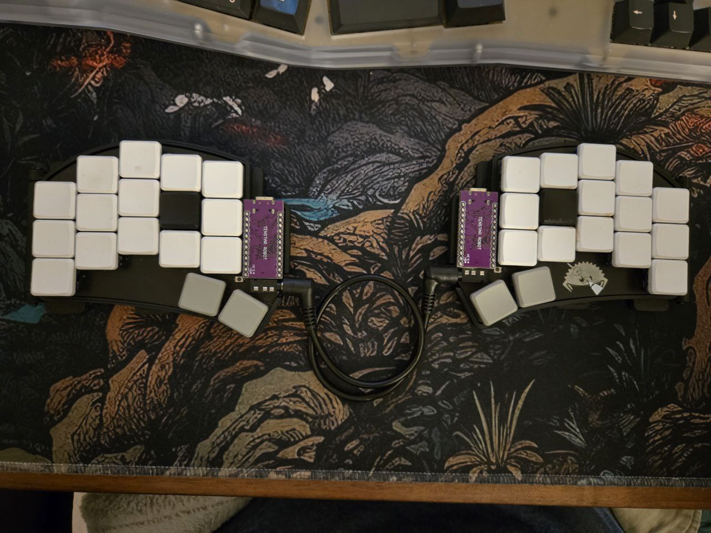

The ferris is a keyboard I actually didn't have that much interest in using
but I found it so absolutely adorable when I saw it sitting unused I had to
buy it from a friend.

This was actually not my first run in with this keyboard since the aforementioned
friend actually requested some help fixing it when he had first gotten it. So I
have had it in my hands before to touch up some of the solder on a switch or two.

This is keyboard is an open source hardware project and can be found at
https://github.com/pierrechevalier83/ferris. This actually fits a pretty
similar niche to me as my Corne which I already wasn't using. But what made this 
keyboard so irresistable to me was it's absolutely adorable carrying case that it
can slide into thanks to it's low profile design.

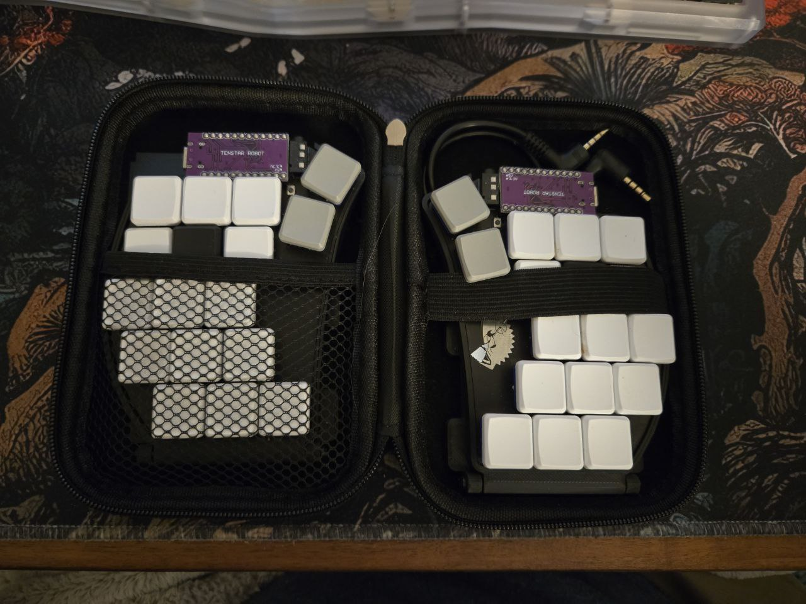

This thing is so small it's borderline pocketable! 

The switches are Kalih low profile choc blue switches.

## Meletrix Zoom65

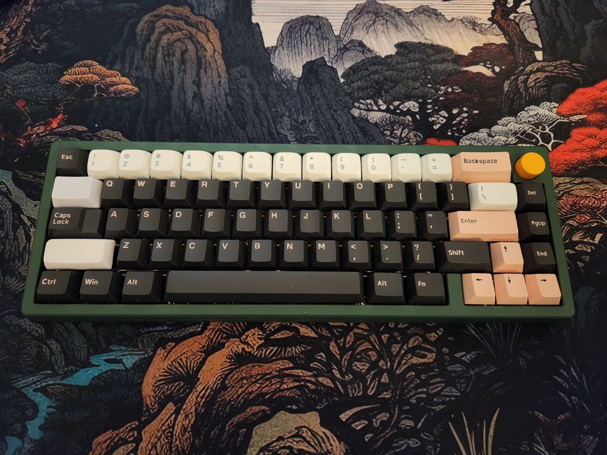

The Zoom65 is a recent addition to my collection. I got this keyboard to replace the Tofu65 actually. I decided I
wasn't a huge fan of the sharp edges, compact key layout, and case color of the Tofu65. A friend of mine actually
already had the Zoom65 and it felt so much more pleasing than the Tofu65 ever did to me.

So when I saw a local listing on Facebook Marketplace I decided to pull the trigger and make this my replacement for
the Tofu65 meaning it was religated to only being used for gaming.

One of the things I was looking forward to about this new keyboard was that it had a wireless bluetooth module built
in already. Although the seller did warn me when I bought it that the bluetooth was un-reliable at best.

Turns out there was some truth to that. The bluetooth worked perfectly for me _at first_. Then one day my primary PC
decided it wasn't happy with the device anymore and proceeded to never be able to pair with it again! I can still use
the bluetooth functionality on every other bluetooth device I own which is very handy for things like my Steam Deck.
But for gaming I am stuck with the hard wired solution for now.

## IF-Corne

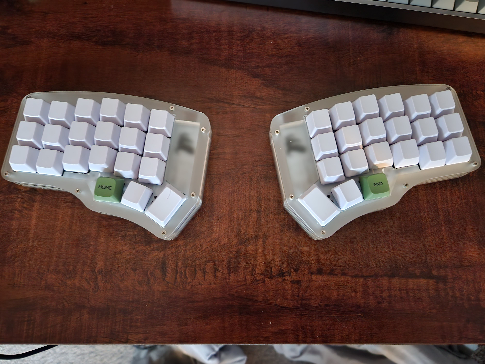

The Corne is a board I picked up in January of 2023. One of the high level features that attracted me was that it was wireless. This was actually something I had not had in any of my keyboards before
even though it wasn't a particularly hard to come by feature. Normal wireless keyboards just never had much appeal to me. However I thought the Corne looked more interesting as a wireless build since that
highlighted the fact that the two halves were completely disconnected.

Another interesting part of this keyboard is that it has an ortholinear layout. This refers to the fact that the keys are lined up in perfect vertical rows instead of being staggered like a normal keyboard.
This is something that had started to become trendy in the enthusiast space and I had never actually had a chance to try typing on anything like it.

The 40% layout was also an attractive feature. I loved the idea of the minimal desk footprint. This was actually not the first 40% keyboard I had (that goes to the Mercutio) but this was the first one that
I got more involved with in and actually tried to make a layout that worked for my preferences. Also the fact the board was split in two made it feel less "crowded" to me. Since I could spread aout the two halves
it didn't feel like my fingers were getting in the way of each other just in the natural home row position.

For the switches I went with factory lubed Gateron Oil Kings. These are nothing special and I probably wouldn't use them again. It's hard to tell if the switches are being hindered by the case though.

This keyboard is one of my favorite "novelty" keyboards and I actually do keep it hooked up as an option to use in my work setup. The only drawback to this keyboard is the "wireless" aspect is enabled by using a USB
receiver which is an awkward block that has to dangle from the computer for use. I got around this in my work setup by having a friend 3D print a small block to hold the receiver and then securing it and plugging it in
to the back of my monitor to hide it.

## Mercutio 40

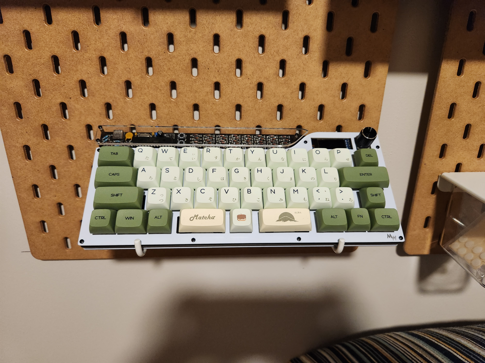

The Mercutio is a board I got in the September of 2021. The primary two features that sold me on this board were

1. The heavy amount of DIY involved which I wanted to do to get experience in soldering which I hadn't done before
2. The dirt cheap price of 80 bucks (dirt cheap compared to my 400 dollar DIY kit I had previously gotten for the Maja 🙃)

This board was incredibly interesting because it was designed to be a "get your feet wet" type of board. I could get my feet wet in 40% which before this board I had never seen in person. Then I could also get hands on experience
with soldering which I had never done on a keyboard before (my soldering experience was limited to Raspberry Pis in college).

Once I had all the materials I spent an entire day on a foldout table in my living room with all the windows putting this keyboard together. The experience was frustrating at the time but was definitely a [type 2 fun](https://www.rei.com/blog/climb/fun-scale)
that I look back on fondly. Getting the build completed was incredibly rewarding and when I am explaining keyboards to people it's one of the first keyboards I grab off the wall to show off.

The exposed resistors and components on the top of the board is a very busy and complex look that none of my other keyboards have and it acts as a good reminder of the work that it took to put the entire thing together. I also am a
big fan of the tall and profound knob in the top right corner. I never actually use features like that functionally but I do find it visually interesting how it towers over the other keys on the board. It reminds me of the more unique artisan keycaps but without
compromising the functionality of a key under it.

For the switches I got a set of Gateron Milky Yellows and lubed them myself. The switches are very "okay". Nothing noteworthy or worth writing home about but not bad by any means.

Finally my favorite part of this build is actually the OLED screen in the top right to the left of the knob. When the keyboard is plugged in you actually get a drawing of [bongo cat](https://bongo.cat/) on the screen with a small "WPM" counter. Then as you
type it will show your words per minute approximately in real time on the screen. And the higher the number goes the faster the cat bangs on the table. This is a must show when showing people my collection for the first time.

The only thing that I don't think turned out optimally in this build is that I didn't have the exact right keycaps for this layout. The spaces around the bottom keys are supposed to actually be flush but I never could find any appropriate keycaps to fit the space.
Also since the board is cheap it doesn't feel the greatest to use for extended periods of time since it's very "angular". The edges of the case can be a little tiresome on the hands.

## Vulcan x KBDfans MAJA

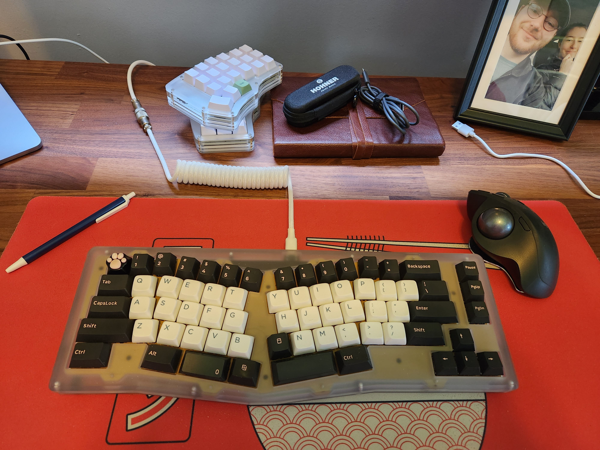

The Maja... Where can I even begin with this keyboard. This is by far my favorite keyboard in the entire collection. I bought this keyboard as a "DIY Kit" from KBDFans in May 2021. I remember this was a risky purchase for myself. Up to this point I hadn't ever
owned a "luxury" keyboard as they say on Reddit. All of the keyboards I had bought were pre-assembled and manufactured in mass, I'd also never had to bother with anything like lubing my own switches, and I certainly owned NO keyboards with an absolute brick
of a brass weight in the bottom of the case. This was the keyboard that made me realize how nice keyboards really could be and doomed me to a life of oppulance with all my future keyboards.

For being my favorite keyboard I don't have a lengthy description for it. The short of it is "it works" and has been my daily driver workhorse since the day I built it. The ergonomic layout is a perfect compliment to my natural typing style. All the way down to the
position of the thumb cluster keys. On the left thumb cluster I always ask people which they think is mapped to be my space bar. Without fail, every person says the largest of the three keys. That's where it was mapped at first when I configured the keyboard. But
in reality after only a week of use I realized that was the wrong place for the space bar. The space bar is actaully the smallest key on the thumb cluster. I put it there because it lays _perfectly_ where my thumb on my left hand naturally rests.

This build I ended up using Gateron Brown switches that I lubed myself (over the course of many days of painful tedious work). Browns have always been considered in the community to be a more "basic" switch and not as prestigious as some of the home brewed franken-switches
people come up with. But throughout all the keyboards I've ever built or bought I've always considered brown switches (Gateron or Cherry) to be simple yet effective. They're easy to come by (default in a lot of builds) and they feel just as good as some of the expensive
switches I've used.

The layout is an "Alice" clone but it deviates by putting the three "functional" keys in the top right instead of the top left. I think this was a good choice since that's where my fingers naturally will reach for things like page up and page down.

The only thing that I consider not perfect about this build is the Polycarbonate case. This was an intentional choice I made when I bought the kit to get since I thought it would be the coolest. And I still do think the Polycarbonate look is good I don't think it looks
great with the brass PCB plate on the inside. I think if I were to build this again I would have picked something more traditional like a white case. I later on saw the KBDFans Mountain keybaord and I don't think I've seen a more aesthetically pleasing keyboard ever since
and it might have tainted my view on the Maja that I have.

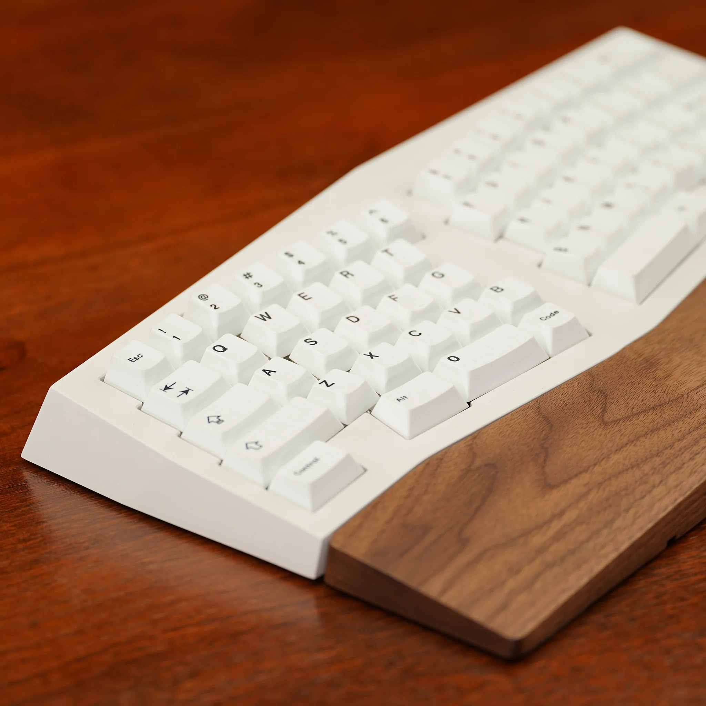

## Tofu65

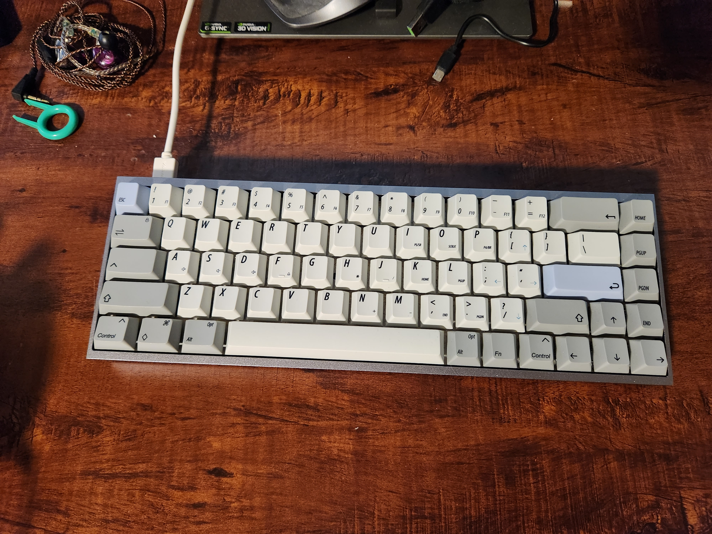

This Tofu65 is by all definitions my "nice but boring" keyboard. I bought it in February 2022 because the Maja I had previously built had increased my standards for "nice" keyboards but the Maja had one fatal downfall. It is TERRIBLE for gaming. The layout is perfectly
designed for long typing sessions but felt absolutely atrocious to do anything like gaming on. So I needed something more "traditional" to use on my personal gaming computer. This also doubled in the benefit that I didn't have to carry my keyboard back and forth between
my work desk and my personal computer. When the keyboards have brass weights in the bottom of them this becomes even more of a nice to have.

The Tofu IS a nice keyboard. I ordered it from KBDFans with lubed quicksilver switches which feel good to type on (This is actually what I typed this post on) but the keyboard is very "bland" and nothing exciting. It has no personality. I think I'm going to look into
getting some new keycaps or something to try and breathe some more interest into it.

It is sub-optimal for the linux experience though since the `~` key is unfortuantely hidden behind a function key which is awkward to activate. Also the home and end keys which I actually use very often are also a little out of reach for my taste.

## IBM Model M

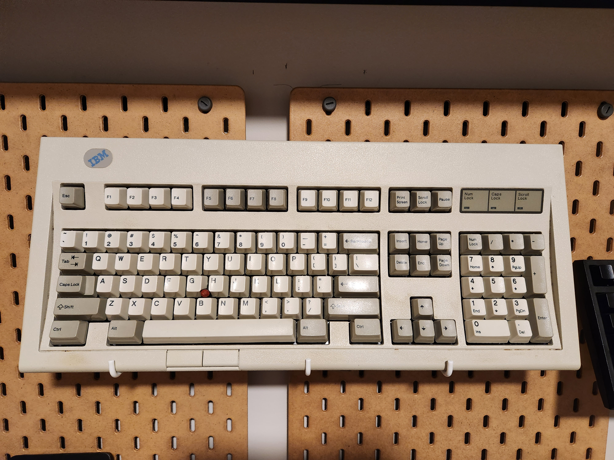

The Model M is a staple keyboard that was mentioned so much in the enthusiast space when I first got into mechanical keyboards. It uses a buckling spring instead of an actual mechanical switch but the sound is closer to the ping of a M1 Garand than a keyboard.
I think this is the novelty that made it attractive to enthusiasts. I actually came into possession of mine while working at Federated Mutual Insurance. I was friends with someone on a team that was cleaning out our data center of all the old equipment that was never
going to actually be used. And in that were a couple of these keyboards. I was offered one to take home and I graciously accepted.

I've never actually used this keyboard on a real computer but instead have left it as a show piece since it's recognizable. I did take the chance to disassemble and clean it though which was an interesting experience since I'd only seen cherry style switches up to that point.

## Das Keyboard 4 Professional

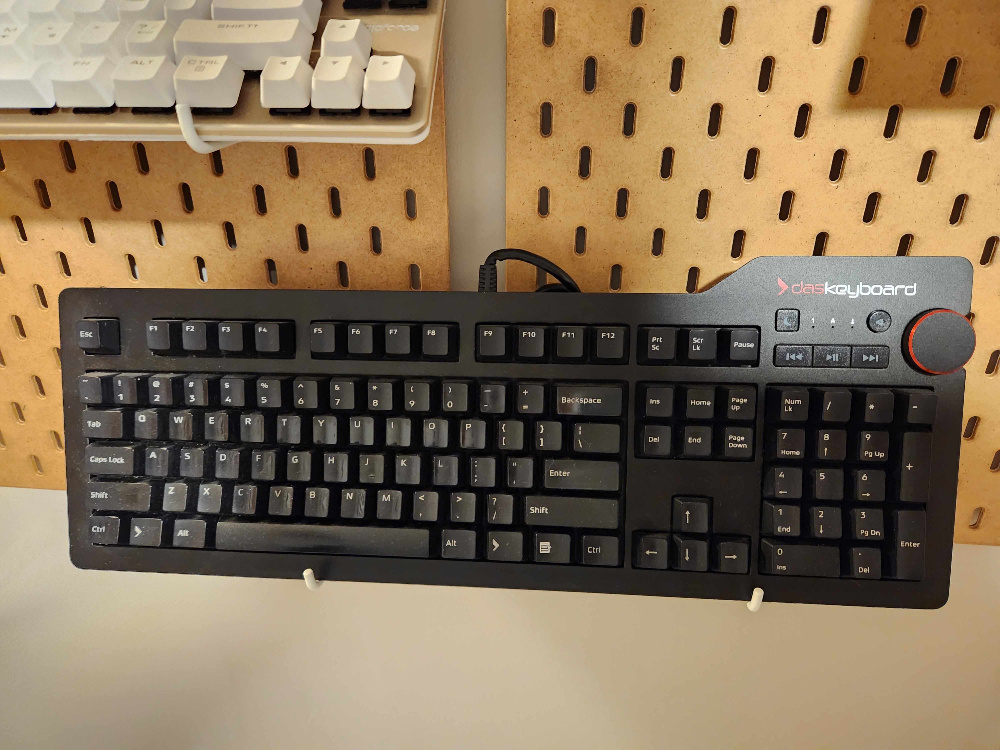

The Das Keyboard was my second mechanical keyboard. I was still living with my parents at the time and couldn't afford the keyboard on my own so in November 2014 I sent a link to my mother over email explaining why I thought this was a good keyboard and worth getting.

Of all my "non-luxury" keyboards this is by far my favorite of the bunch. I actually used this keyboard as my daily keyboard at work when I worked in an office from 2019 - 2021. The only reason I stopped using it is because I went to work from home and had the choice to use my
luxury keyboards which are objectively better. Any time I need to grab and extra keyboard for plugging into something this is the first keyboard I reach for.

The case is made of aluminium which makes the entire keyboard feel much more expensive than it actually was. This also makes it a lot easier to clean than some of the other keyboards (although none of them get THAT dirty externally). This keyboard also features the "just works"
Cherry MX Brown switches that I sang praise for in the Maja section of this post. This keyboard was different from my maja though in the sense that I never actually lubed the switches. Despite this the keyboard still had a good sound compared to other pre-assembled boards I
have owned. I think this has to do with the aluminium case that they lived in.

Overall, an incredibly solid board and has held up INCREDIBLY considering how much I've used it for how many years. The only sign of wear is the keycaps which are beginning to shine from use.

## WASD Code

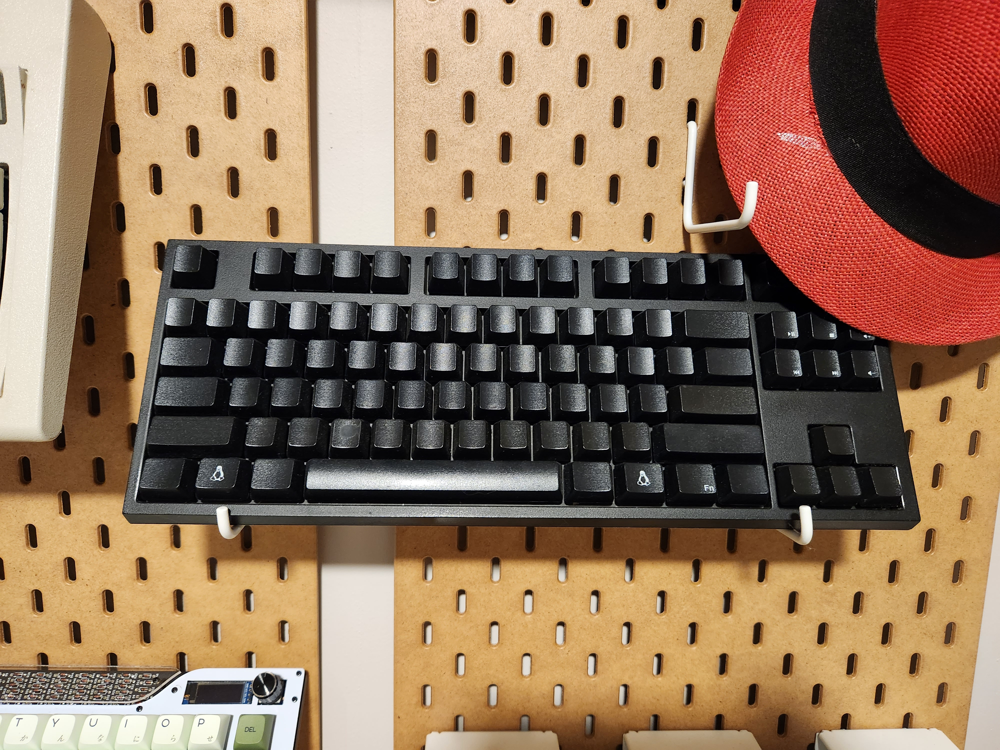

The Code is not a keyboard I have much to say about. I bought it in May 2017 and I"m not even sure what the motivation was at the time. This keyboard's unique features are that it has Cherry MX Green swithces which were very novel and harder to come by at the time. It
also had blank keycaps which were something I hadn't had on a keyboard yet even though I had been proficient in touch typing for years at this point. Finally the keyboard gave you a choice of what to put on the super keys. I was a few years into my Linux journey at this point
and felt like it was a great choice for my super key.

I think the customization was a novel concept to me and part of why I bought this board since at the time I hadn't really gotten into custom keycaps or anything of the sort. All the keyboards I had at that point were pre-assembled and were not modified in any way.

## Magicforce

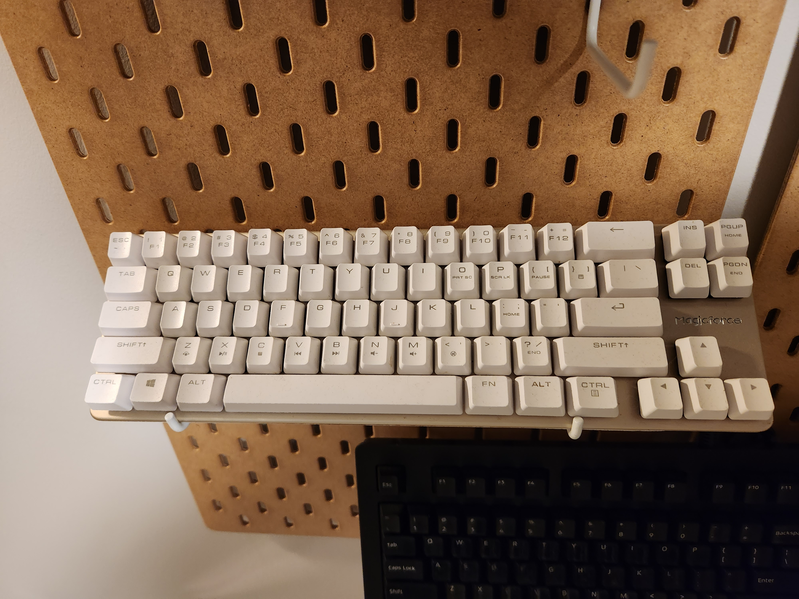

There isn't much to say about this keyboard. I bought it off of Amazon very early on in my keyboard journey explicitly because it was dirt cheap ($20) and had the famous Cherry MX Blue switches. THese were very popular on Reddit when I got into keyboards originally however
I couldn't justify buying something "expensive" that might be offensively loud so the cheapness of this board made it a good opportunity to try it out and see what the hype was about.

This was easily the most disappointing keyboard I had ever used and completely disillusioned me for Blue switches. They are too loud and I like to bottom out my keystrokes so these light actuation forces caused me to get fatigued very quickly.

## Ducky MIYA Pro

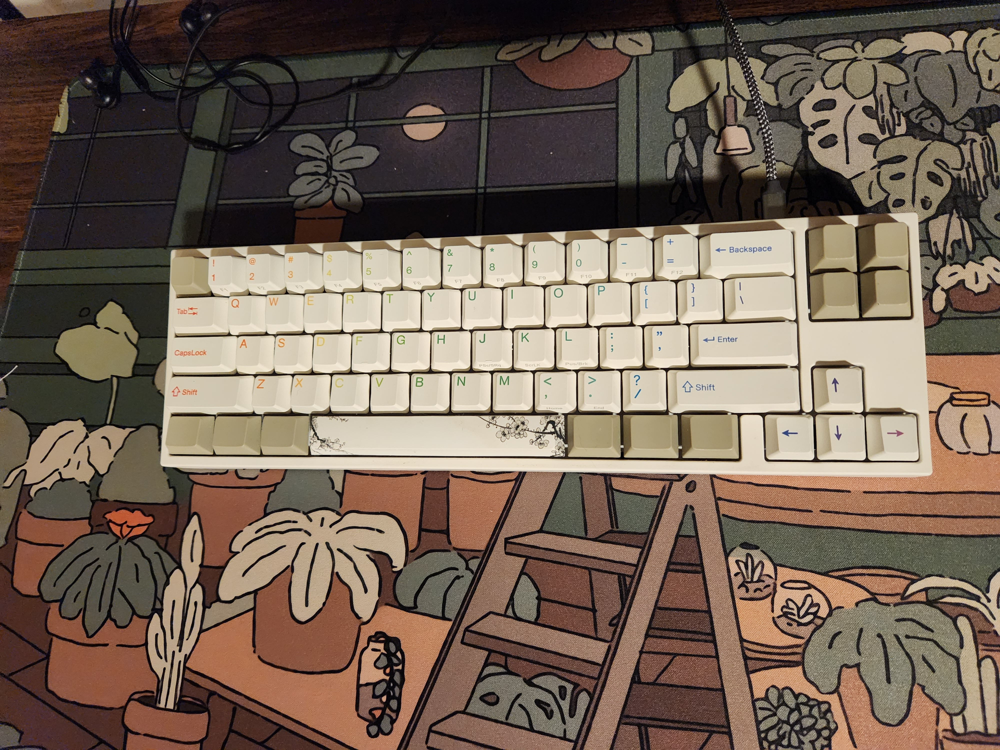

In April 2020 I'm not sure why but I had an itch to get something "new" for a keyboard and ended up picking up the Ducky. This was my daily driver keyboard at home for probably about a year or so before I ended up retiring it. I think the primary draw to this keyboard for me
was that it had a smaller footprint and was a more "bright" color than my existing black keyboards. Space was a hot commodity on my desk at the time which was not very wide at all.

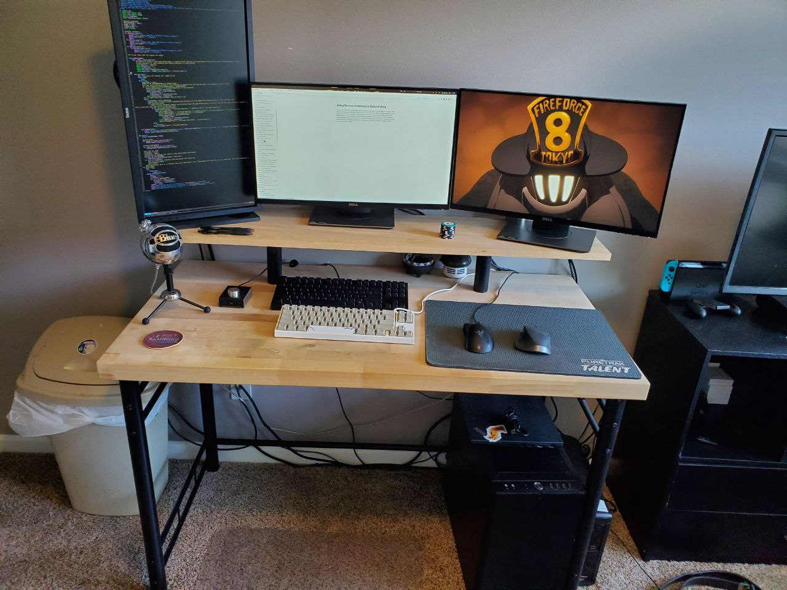

I used a set of gray blank keycaps to replace the rainbow keycaps that the keyboard came with. However, when my girlfriend took ownership of this keyboard she decided she wanted the original keycaps back on it.

## SteelSeries 6Gv2

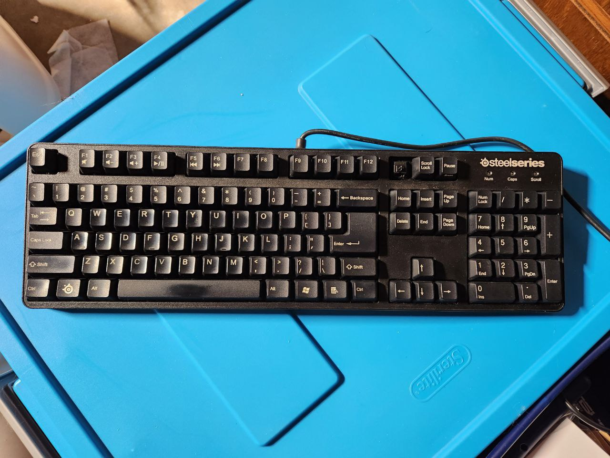

The one. The only. The keyboard that started it all. In June of 2013 I ordered my first mechanical keyboard. I put hundreds of hours into this keyboard and probably would have put thousands into it if it wasn't for the classic blunder of teenaged gamers.
Spilling a can of soda right onto the board. This board ended up getting a case of "sticky spacebar" that I was never able to recover it from.

This keyboard had Cherry MX Black switches and very tall profound keycaps. The board to this day is still aesthetically pleasing to me and the black switches that weren't slathered in Dr. Pepper feel pretty good actually but unfortunately this keyboard will remain just
as a reminder of where I started and what got me into this rabbit hole an entire decade ago now.
