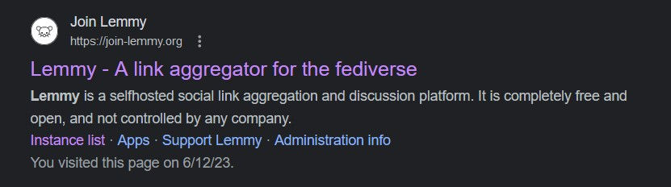
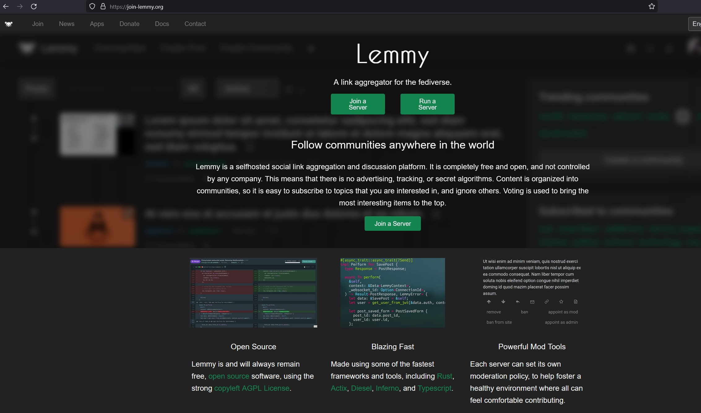
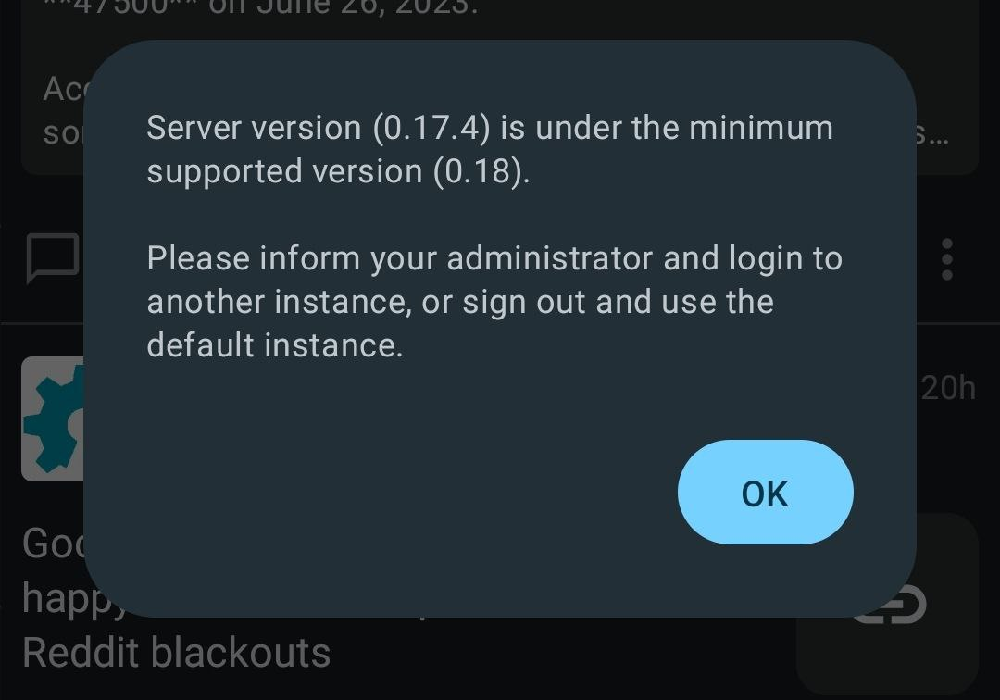

## Introduction

If you're reading this article then I'm sure you're more than familiar with the ongoing controversy regarding reddit and 
it's [API cost changes](https://www.reddit.com/r/apolloapp/comments/13ws4w3/had_a_call_with_reddit_to_discuss_pricing_bad/) which are throttling the throats of third party mobile applications.

This topic has been covered by thousands of other websites and I have nothing unique to add to that discussion so I'll keep it brief.

- Reddit changed the price of it's API to an unusable price for third part applications
- This was most likely to funnel users to the first party application and serve ads (A.K.A: $$$)
- Subreddits protest by going dark and there is a light exodus of users from Reddit to alternatives such as Lemmy

So as a Reddit user of over 11 years I wanted to give a write-up about what I think of Lemmy after using it for a couple of weeks.

I'm going to move forward with this article assumming you're already familiar with Lemmy and the concept of federation. If not you could consider reading
[Lemmy - Beginner's Guide for Redditors](https://github.com/amirzaidi/lemmy)

## My First High Level Impressions

Despite how it may seem based on all of the gripes I'm going to raise in the rest of this article my first impressions of Lemmy are actually
that I'm impressed! I think that this platform is **very** close to being a great Reddit drop in replacement but that makes the concerns I have
run into feel that much more important and worth pointing out. 

I'm a mobile only user so all of my notes are going to be from that perspective. I have been using [Jebora](https://github.com/dessalines/jerboa) as my mobile client.
When I first started using Lemmy it was the only option but in the last couple of weeks a [plethora of alternatives have come into development](https://lemmy.world/post/465785) 
and I'm sure something better will appear in the near future.

I've been using Lemmy 100% instead of Reddit for the last few weeks and I've actually been enjoying the experience a lot. The first few days there were some
issues with how content was presented on the front page which made it _seem_ like there were no new posts coming through but since then it's been updated and
at times the front page feels active and lived in and I can even find myself scrolling through the content for a little bit before I start hitting two day old posts.

The communities that have appeared are in line with what I would expect of a Reddit alternative and it doesn't feel like I'm _missing_ anything important communities that were on Reddit before. 
Well... I do, but I'll get into that later. For now, I want to stop rambling and move into specific points that have caught my interest while trying Lemmy that I think will hold it back from
mainstream success.

### Sharing Links Across Instances

Let's say I'm logged into lemmy.world and I see a post from lemmy.ml. I then decide it's really interesting and want to share it with my friend. What do I do? I copy the URL and this is what I get:

https://lemmy.world/post/687440

You'll notice that this link is specific to my instance. If my friend is signed into any other instance Lemmy isn't going to respect that and they'll instead be taken to this post as it is on lemmy.world

This means they can't upvote/downvote the content and they can't interact with or create any comments. Even if I'm using the mobile app Jebora it isn't smart enough to intercept these links and then
translate them into where that post is on my local instance. Instead the link just opens in my web browser like I don't even have an app for interacting with Lemmy.

### Fragile Accounts

Once you finally go through all the process of signing up for an account it will probably not feel great when you realize that if anything ever happens to the instance your account is under
or if the moderators decide they don't like your account then you can suddenly be removed from the instance. This is a real problem since your user is not federated to other instances. 

This can not unrealistically lead to situations where you have to create a new account on a new instance. You're suddenly going to find all the following gone:

- Your posts
- Your comments
- Your saved posts
- Your subscribed communities
- Your blocked communities

These can be devastating things to lose because either a volunteer didn't like you or because hard times fell on the instance owner and they shut down the instance. Because users aren't federated this
means your only recourse is to create a new account on a new instance. You will have to manually re-join all the communities you were in, you won't have access to your post history any more, and if
you're a large contributor to a community who is known by name this can be even worse since your new user will look like an impostor to everyone else unless they take you at your word that "no trust me
guys it's actually me on my new account".

### Pretending to be Someone Else

The fact that users are instance specific means that if I take the username "SuperCoolGuy" on lemmy.world then my username is only reserved on lemmy.world. Once I go to lemmy.ml I can sign up for a new
account with the exact same username. Granted if you post in another instance your username will show your instance name in your username. But how do you tell the difference between "SuperCoolGuy", 
"SuperCoolGuy@lemmy.ml" and "SuperCoolGuy@lemmy.world"? 

### The Default Home Page

Part of the federation of instances is that when you sign up for an instance you're going have a "local" page (which is the default home page) which will show you content from all the instances
that your current instance actively federates with. On most instances you're not going to have a problem with this page. It may not be _exactly_ what you are looking for but that's okay, that's
why we have the "subscribed" page where you can see communities you've subscribed to. Problems can arise in two types of way with this page.

The first is if your instance defederates with certain communities. In that case you may **never** get to see content that would have been interesting to you because it never gets shared to your
current instance. This is annoying but more of a "back of the mind" problem since you don't actively see posts missing.

The second way this can be a problem, which is more annoying, is if there are lots of communities you don't want to see content from on your instance's local page. For example, 
I looked at the lemmy.nsfw instance to see what kind of content made it's way to Lemmy early on. Because I wasn't subscribed to any communities I used the instance's local page which was an
incredible mistake. Because now I have to stop at every other post and see some incredibly non-vanilla content which is "undesirable" to put it lightly. I then have to manually click on part of
the post and block the community for myself individually.

If I wanted to make a separate account for lewd content I would probably want it on the NSFW instance because that's where I'm going to have the highest chance of seeing NSFW content that my normal
instance hasn't defederated. But now every time I open the application and decide to "explore" I'm opening myself up to seeing lots of content that is borderline vile.

### Ghost Communities

As part of the exodus from Reddit to Lemmy you'll notice that there are a lot of communities that are based on existing Reddit communities. At first this makes it feel like you're not going to be missing
out on anything when you make the switch. But once you start looking more into these communities you'll find that they have almost no posts or they're only posted in by a single person who created the 
community and is trying to jump start it.

There's not much you can do about this and it's expected when you're creating a new platform. Some people need to take initiative and make content that attracts other users who can then take over
doing the posting which is a positive feedback loop. 

My concern with this approach is that it's trying to create a 1:1 copy of Reddit by creating some of the more niche subreddits/communities as well. I think this concept only works on Reddit because
there was a more natural progression of community creation. When Reddit first started you had your normal "/r/all" level communities that were populated but were more generic. For example, /r/funny and
/r/pics. These are incredibly broad topics but that made it easy for many people to be attracted to them. Then as the subreddits grew they would naturally reach a point where users wanted more niche
content or more cozy communities and they would break off into a new subreddit. 

By trying to recreate everything on Reddit you're skipping the step where the mass of the users all aggregate in the few large communities and then break off into communities as they're needed.
This results in individual users spending all of their resources being the only poster in a community with five members while the main communities are neglected which makes the platform feel less
populated than it may actually be.

## Barrier to Entry for Casual Users

This is what I would consider to be Lemmy's biggest hurdle for adopting users. I think there are a lot of roadblocks that a non-technical or more casual user would run into that would become
blockers from them signing up for the service or trying out the application. With that in mind I'd like to dive into a case study of someone who we'll assume is non-technical trying
to get into Lemmy and what hurdles they might run into.

**NOTE:** This is all speculation based on my experience with signing up for Lemmy and how I believe this will impact new potential users. There are many assumptions in the following but I don't
think any of them are unreasonable.

### First Time Looking For Content

If I'm trying to use Lemmy for the first time what will I do? If I'm on mobile I'll go to the google and probably search for Lemmy just to see the main page and get a taste for what content is there.

Instead when you go to Google and search for "Lemmy" you're going to first actually be greeted by the Musician and then secondly you're going to see this link

There are no other links that seem to be useful on the front page of Google so this is my best bet. But what do I find when I get here?

A sales pitch page and a call to action:

This is already a step in the wrong direction because as the user this was my only way to find content from Google and I'm now seeing I either need to "join" a server or I need to run a server.
I'm obviously not interested in running a server since I don't even know what this is and I don't want to join the website until I know what content I'm signing up to see. For many users this is an
instant roadblock and it's easier for them to simply close the tab to never return.

### User's Experience Signing Up For Lemmy

If the user is persistent they may click the join button in hopes of getting through to content after a quick sign up. However what they find isn't a sign up. Instead they'll find a list of "instances".

What the user finds here are a handful of links that are resources for researching instances and then a nearly infinite list of options to choose from. Although it feels like it's fair to ask a user to
do light research when signing up for the service you have to consider we're talking about mass adoption here. When I sign up for any other mainstream social media I am not going to face any of these
barriers. I will simply get to the home page and see content then if I like what I see I can sign up in a single place.

How do you think it would impact the user base of Twitter if signing up required an informed decision from the user. You would instantly block the gates to most "normal" users who don't want to do 
work to access content.

### Picking an Instance

If the potential user is still onboard and trying to get to the content at this point (which I would position that 99% of people are gone at this point) and they've gotten a taste of the content.
They've probably done so by clicking on a random instance and seeing it's "local" communities and "front page". This will probably be a _fine_ introduction to the concept of the site but the local page 
of each instance will not show "all" by default but instead will show communities that the instance interacts with directly. I think this could give the user a misleading representation of the site but
in most cases it's probably good enough.

Let's say they've browsed some content at this point and they decide "okay, I want to sign up now". They're going to probably start asking questions like "Does it matter which instance I pick?" If
they've made it this far then they've probably either talked to someone or read somewhere that you can sign up for any instance because content is "federated" and all posts and communities can be
accessed from any instance.

### What is Federation?

It feels like all discussions of Lemmy lead back to the topic of Federation and I think for normal users that's a red flag. My significant other is a smart woman and is actually a somewhat active user on
Reddit but she's not a tech person. So when I started using Lemmy and telling her about it she had questions like anyone would if they were deciding they should investigate or not. And the discussion
would always makes it's way back to federation and I would lose her.

I'll take this time to say that I actually love the idea of a federated platform and think it provides a GREAT benefit over services like Reddit. However, I think as it is today this is going to be a big
blocker for mass adoption from users like my girlfriend who just want content easily.

### So it Doesn't Matter Which Instance I Pick?

Once the potential user gets an introduction to Federation it's easy to make the assumption "well if content is accessible from anywhere then it doesn't matter where my account is right?" And that
couldn't be further from the truth. While technically how you interact with content may be the same on any instance there are going to be some important things to consider that make the decision much
harder.

**How many users does your instance have?**

You need to consider how many users your potential instance has because if the instance isn't run by someone with lots of resources then more users means you're going to notice more latency as the
instance struggles to keep up with the load of the users. 

But on the other end of the spectrum if you have to few users then the instance most likely won't be federated with most communities until you
go out of your way to interact with them which will cause the instance to start curating that community.

**Who is running the instance?**

Anyone can run an instance. It's part of how the decentralization works and what makes the service attractive. The problem is when you sign up for an instance your account is now at the mercy of
whoever is in charge of this instance. This is like if subreddit moderators had the power to ban your Reddit account. Leaving that power in the hand of regular people who don't report to anyone but
themselves feels... Uncomfortable to me.

Also you're always at risk that one day running the instance can decide it's not worth it to keep running anymore and suddenly the instance hosting your account is gone.

**Has the instance defederated with any other instances?**

Instance owners at any time can defederate with any instance they choose. This is basically a ban from any content from that instance making it's way into their instance. What if you're hoping to get
political content on Lemmy but find out the instance owners thought the content was to controversial and decided they didn't want it on their instance? Suddenly this is no longer a good instance for you
since there is a section of the website which is inaccessible to you.

**Is this instance up to date?**

Part of running an instance is being an actual server administrator. That means when Lemmy gets an update you have to update your instance to match the latest versions. This is true for services like
Reddit to but you don't feel it because all the servers are owned by a single organization and they do controlled rollouts of new versions. However, with independently owned instances you now have the
potential for your instance to be not updated at all. 

I've already run into a problem with Jebora where every time I open the application I get a warning that the server isn't up to date with what Jebora is expecting it to be running which can cause
compatiblity issues.

Now what do I do? Twiddle my thumbs and hope the server administrator is prioritizing updating this? What if my jebora application just doesn't work because the compatibility is so far off? 

While I was writing this article I logged out of all my accounts on the Jebora app to remind myself what the app looks like without an account and now because of the error I mentioned above I
actually cannot log back into the app with my main account. So now the application is unusable to me unless I use my phone's web browser instead and give up any luxuries from the app. And note
that I'm not talking about a tiny instance. This is lemmy.world. One of the larger instances at the time of writing...

## How to Improve These Issues?

As I conclude this post I want to reiterate that I **like** using Lemmy but I think these are non-trivial issues that I've experienced that would deter others from joining themselves.

I want to wrap this up by touching on some of the issues I mentioned in this article and some starting ideas for how they could be improved.

### Federated users

I think that there needs to be a centralized concept of "users" that instances share. I understand this is hard because then you're opening up anyone who starts an instance to getting a local copy of
all the data associated with those users. But without something like this then accounts feel too fragile and if my account gets wiped out because of someone else's decision I'm simply not creating
another account.

### Standardized Supported Versions of Lemmy

As Lemmy iterates through versions I think there needs to be a concept of "LTS" versions or the community needs to agree on a life cycle for versions. 

This would give application developers something to target for backwards compatibility. If my app is only targeting the latest version of Lemmy then I'm bound to run into issues
where my instance doesn't have the features needed for my app. 

This would require more work on the application developers but it would at least give them a more reasonable target of what version(s) they should make their application
compatible with to satisfy the highest number of users.

### Better link sharing

If someone shares a link with me from another instance it should be trivial for my mobile application to intercept that link and open it in the application. This is the same concept as when you open a
Twitter link on your phone and instead of going to twitter.com in Chrome you're immediately in the app seeing the content natively where you're most likely logged in.

This becomes more difficult for the application since it has to tell the operating system that it will handle lemmy links. But lemmy can come from thousands and thousands of different links so how do you
tell the operating system which links you'll handle? I think this problem requires either some kind of centralized service that can be used for permanent links or third party applications have to do a
best effort attempt at identifying popular instances and intercepting links to those instances.

If there's not a way to instantly get any link from Lemmy from someone else and then interact with that post myself it will make engagement much more difficult. 

