## Introduction and History

**Warning: This is going to be a _long_ post and I am not going to trim any rambling :)**

One of my hobbies for about a decade now has been "homelabbing" or "self hosting".
Homelabbing started for me as a way to dip my toes into the Linux universe without
committing to running it on my precious gaming PC back when I was in college.

As I studied computer science I wanted to play around with concepts I was seeing at
school and had no experience with. Back then it was simple things like LAMP 
(Linux, Apache, MySQL, PHP). I didn't really host anything noteworthy but this was how 
I started to learn about Linux, Networking, Web Development, and all the fun niche topics
that fall underneath those broader umbrellas.

At the time in 2015-2019 my lab always consisted of a computer or two running bare metal
Linux. I can't begin to imagine how many times I installed Ubuntu Server `16.04` and 
`18.04`.

The next evolution of my lab was running VMWare ESXi on commodity hardware. This allowed 
me to condense my footprint and start exploring all the new fun topics that were involved
with virtulization.

Now that I could easily add more servers without increasing my hardware footprint I 
started looking for "useful" things that I could run on at home to become less dependent
on other companies. To be honest, most of the things I hosted never ended up getting used
much and were mostly just experiments on going through the exercise of installing and
configuring software.

Throughout the years I never really stuck to a single "lab". One lab would get heavy usage
for a year and then it would get powered off and forgotten for months before some new
shiny hardware came around as I found antother project I wanted to work on.

I was always interested in more "permanent" labs that served more purpose to me but it
never felt right at the time since I was living in rentals and didn't have the freedom
to build out my "vision". 

That changed a couple years ago when I purchased my first home and I could finally start
building more "permanent" infrastructure into my home. Now I have a honestly pretty
crappy setup but it serves it's purposes and gives me lots of room for projects 
to keep myself busy.

I'm hoping that by taking inventory of what I've done I can both appreciate the work
that got me here and give myself some benchmarks to compare against next year both
relatively comparing what I have vs what I had and checking if I accomplished any
of the goals I was hoping to.

## Current State of the Lab

The current state of my lab is far from what I would call "production grade" or 
"the vision". Everything that currently exists was very "one choice at a time" and didn't
come from any coherent strategy that tied everything together.

Here is a diagram that shows the high level layout of everything. I'll go into more detail about what each component is responsible for later.

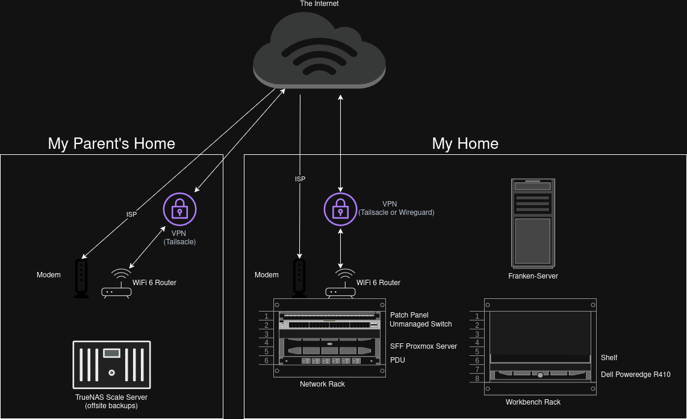

## What I Did in 2024/2025

### Network Rack Installation

When I first moved into my current house I didn't actually have any real infrastructure
so I decided to start with just the basics of networking. The primary goal of this was to run Ethernet through my house. 

All of the ethernet I ran needed to go somewhere so I installed a wall mounted network
rack to host my router and a simple unmanaged switch that everything could be run to.

This is the rack that is pictured at the top of this post.

### New Small Form Factor (SFF) Proxmox Server

In September 2024 I had my networking in my house and decided I wanted a "real rack
mounted server". I want to be perfectly clear that I knew that putting a full 
fledged server into my existing network rack was going to be a terrible idea.

Unfortunately the devil on my shoulder has a way with words and I'm so easily
swayed into trying to make things happen that have no right to be.

This build is the antithesis of all things good and holy in computing. 
I should have known by the fact I had to spend many months just spent researching
to source a rack mount chassis that fit my "needs" which were:

1. Fit in a short depth network rack
1. Fits a Mini-ITX Motherboard
1. Has room for an HBA card
1. Has room for many HDDs/SSDs
1. <= 3U in height

Eventually I did end up finding a very niche case that fit all of my critieria and
it was even on Amazon! I'll be damned if it had no reviews and no one on the public
internet had ever so much as looked at one of these things from what I could find on
Google.

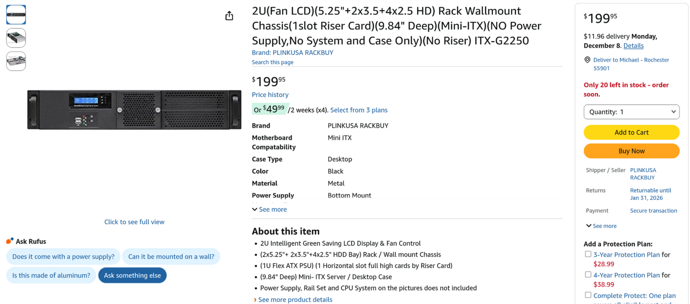

I was hoping this could be _the build_. the "one server to rule them all" 
that could fit into my existing network rack and save myself from getting a full
fledged rack that would take up floor space  just to host a single server. 
Not like I would ever want to add more servers, right...? 

I wanted this server to be a proxmox node running all the following services:

* Pihole
* Nginx
* TrueNAS Scale (With an HBA passing the drives directly to the VM)
* Jellyfin
* Paperless NGX

Despite knowing in my heart this was truly a terrible idea I continued forward and 
started building. I think the two following pictures do a great job of illustrating how
ridiculous this idea was.

Here is the "dry run proof of concept" to make sure all the hardware worked before trying
to make it fit inside the microscopic case.

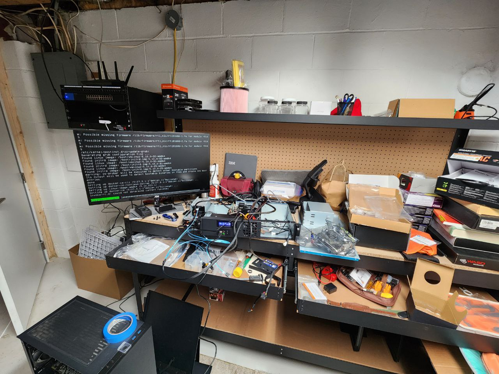

And here is how everything ended up actually fitting with **much** persusasion.

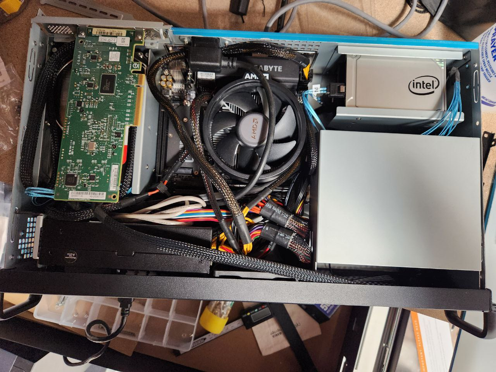

And after a concerning amount of sweat and cursing I finally was able to get the lid
onto the thing.

Surprisingly against all the odds this server actually has done pretty well the last
year I've had it running and somehow runs at a reasonable 31°C year round.

However, it became clear that this would be no "one server" situation and some
shortcomings were highlighted once it was running that sparked the need for a new
secondary node to compliment it. I had already blown my lab budget for the year
so things had to get, resourceful...

### The Franken-Server

Once I had the SFF server setup and running it started to show some cracks from
getting too close to the sun. The biggest issue I ran into was that the integrated
GPU on the CPU I was running wasn't actually cooperating much when it came to
running Jellyfin and I didn't install a discrete GPU that could be passed through
to the VM.

This was the catalyst for needing a second server that could house a GPU and run my
Jellyfin VM a little more comfortably. This wasn't too hard to throw together since
I had a tower which was previously my primary Proxmox server. I just repurposed it
and got it back up and running without much effort. 

But now that I had a second node I started to consider some "quality of life"
improvements that I could get with a second node. Namely:

* Secondary Pihole instance to act as a backup
* Orbital Sync to keep both Pihole configurations in sync
* Proxmox Backup Server (PBS)

Jellyfin and Pihole were able to run out of the box with the hardware as is
without any issues. However, there was one little issue with the PBS workload.

I wanted to not only backup my VMs but the underlying data on my TrueNAS server.
The way I achieved this was quite hacky. Since the data lived on drives connected
to an HBA passed through to the VM there was actually no way for PBS to back up the
data since it wasn't part of any Proxmox pool. So I created a tertiary VM that's
only job was to mount all of my SMB shares and use the `proxmox-backup-client`
command to send all the data to my PBS server.

I actually had spare drives laying around that could add up to the amount of storage
needed to hold these backups but it was across many drives that my case simply
couldn't accomodate phsyically. What I did have, on the other side of the 
room though, was a spare ThinkStation tower that had a nice HDD caddy that wasn't 
filled with any drives. So I'll just remove a few screws, take that caddy, 
and find a way to secure it to our existing case. Easy peasy.

It was not easy peasy...

It turns out that all the bits I wanted to remove were actually riveted to the
chassis and even after removing those rivets there was seemingly nothing but the
will of the universe holding this cadddy up.

Frustrated and throwing all caution to the wind the extraction methods started 
to become, drastic...

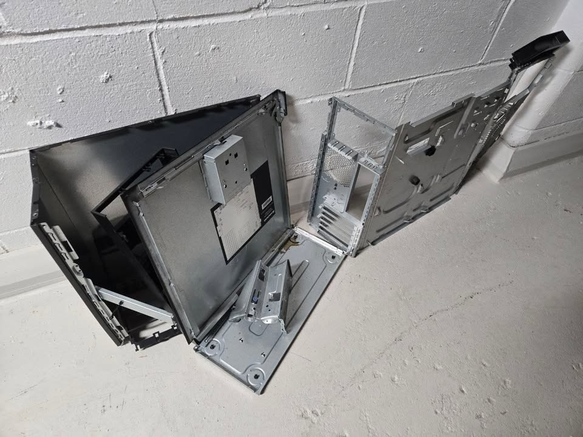

But in the end I ended up with one beautiful and isolated HDD caddy.

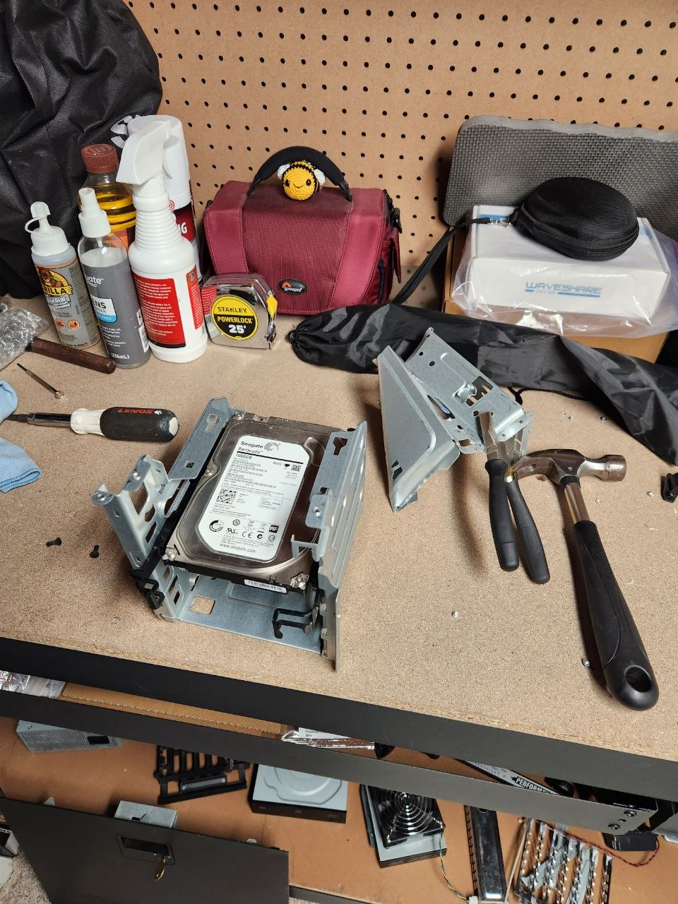

And one "secure installation" later I had our final beautiful secondary server to
compliment the first abomination I built.

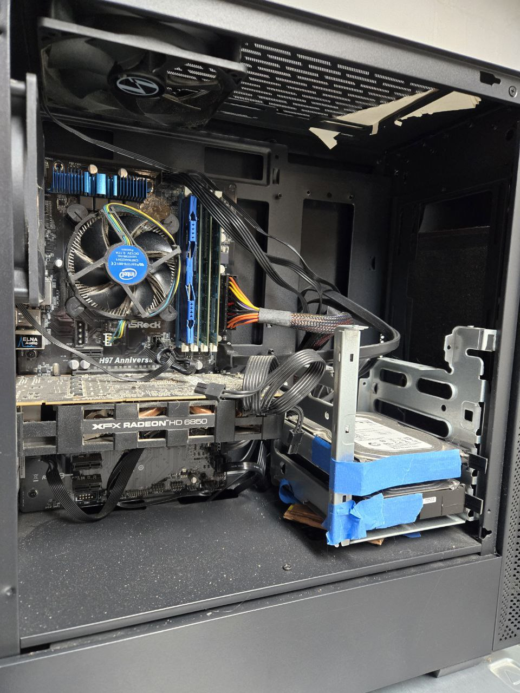

_**NOTE: there are two HDDs not pictured in the bottom of this case**_

### Wireguard and Headscale Setup

As I started running some services that I actually wanted to use outside of the home
I decided to start researching options for accessing my services. I already knew
that exposing the services directly to the internet was a bad idea and not something
I was interested in. But I did have a _little_ experience with Wireguard as a VPN.

I had configured it previously in a past iteration of the lab but it never got real
primetime use since I didn't have any services I actually cared about using often.

As I was exploring my options I was lookin through my router (Netgear RT-AX3000) I
noticed that it actually had a feature I was unaware of which was the ability to
one click setup a Wireguard instance directly on my router.

I thought this was neat so I purchased a static IP from my ISP and tried it out
and was honestly really impressed with it. To this day I really haven't had any
issues with it but I don't actually use it that much.

While using Wireguard I ran into another solution called "tailscale" which also was
interesting and looked easier to onbaord new nodes to without configuring each
server manually to use the VPN.

One thing I didn't care for though was that Tailscale was proprietary (ew, yucky)
so I researched if it could be self-hosted and was introduced to "headscale" which
is a self-hosted control server that you can connect to from any normal Tailscale
client.

I was able to configure my headscale and Pihole together in a way where if I'm on
my home LAN and make a request to `something.pallid.dev` it'll resolve to my local
LAN IP (192.168.50.x) but when I am away from home and connected with the 
tailscale client I can still use the same URL to reach my Tailscale IP (100.64.0.x).

Headscale ended up becoming a critical part of my homelab network as I expanded into
a colocation strategy for my TrueNAS.

### Offsite TrueNAS Scale

This project was the culmination of a few forces coming together to make a
convenient excuse to build a new server.

The first issue was that my backup strategy was complete dog water. I was backing
up all of my TrueNAS data to a PBS server that was hosted at the same physical
location. So not only was it hard to actually "recover" the data by manually
invoking `proxmox-backup-client` commands but it was also not preventing a physical
disaster from wiping out all of my data.

The second issue is that my parents don't have a NAS at home. Their "computer
portfolio" consists of a single Chromebook (god I love those things for family) and
putting all of their important personal documents on Google Drive or worse, on their work devices.

This seemed like the perfect chance to kill two birds with one stone. I would 
make a server that could live at their house full time and they could use for their
own storage needs and then we could both benefit from an offsite peer to peer backup
of our data.

My goals weren't very lofty for this build but I did want to do the following:

* Make it small enough to blend in next to their router in the living room
* Use an N100 MOBO for reduced power consumption
* Add it to my headscale network so it can communicate directly with my TrueNAS instance

And it came together decently well actually!

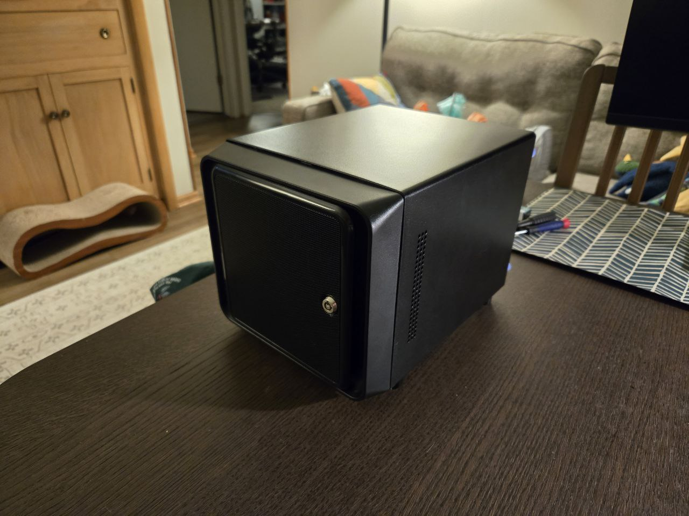

I was able to get this deployed to my parent's house as a Christmas present,
my TrueNAS data is being properly backed up somewhere offsite, and my parents
don't have to store their taxes and irreplacable family pictures on their work 
computers anymore.

### Dell Poweredge R410 From Facebook Marketplace

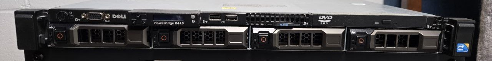

Not much to say about this actually. I found this on Facebook Marketplace for
$20 and decided it was cheap enough I would buy first and ask questions later.

Questions that still have yet to be answered like:

* Can I make this thing run quiet enough that it won't drown out the TV in the next room?
* How much does it cost to power this thing each year?
* What would I run on it that can't run on my existing nodes?

### Homemade Wooden Server Rack

This was actually one of the more satisfying projects I did at the end of 2025.

At this point I am committed to filling out a real rack and separating some of 
the functions of my existing SFF server. I'm also planning to add a dedicated
NVR server next year. To make room for these I wanted to commit to a "real rack"
that coul fit full depth servers.

I still wasn't very keen on the idea of taking up floor space with a rack. While
mulling the idea over I realized there was something else in my "server room"
already and that was my workbench which sported a nice 2' x 6' shelf with no real
purpose outside of miscellanious storage.

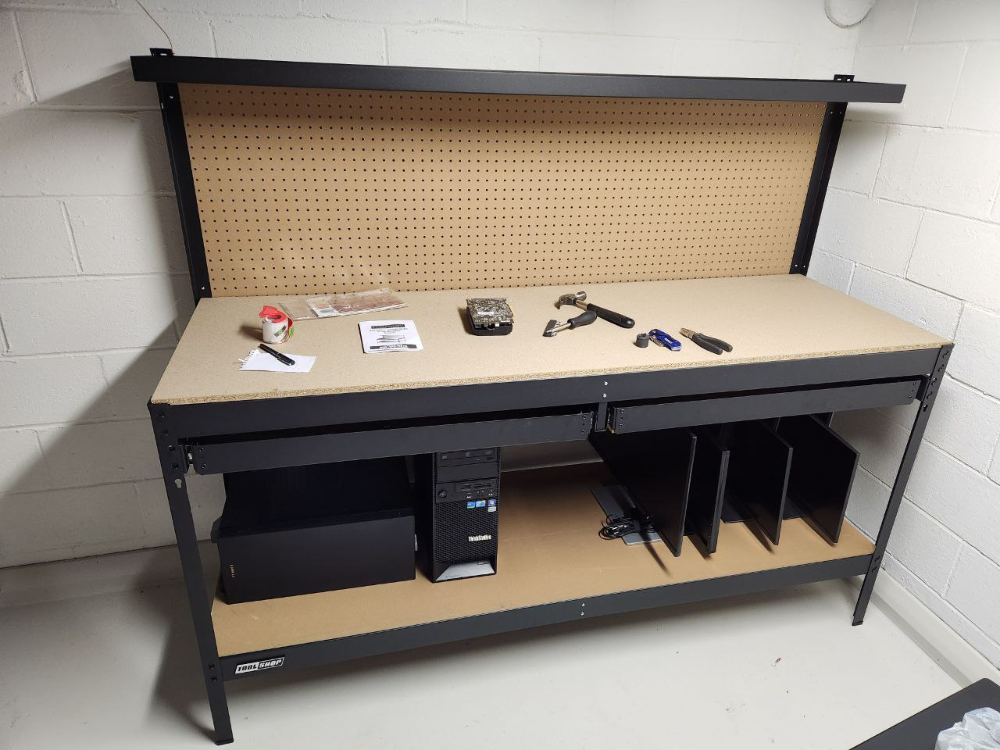

I decided to try and take inspiration from the
["Lack Rack" community](https://www.reddit.com/r/lackrack/) and try my hand at
building something more DIY that could fit in this space and feel like a "built-in"
in my existing workspace rather than a bolt-on like a rack would.

The build honestly wasn't to terribly complicated. Just basically a table that was
19" wide (measured from the inside of the posts) and 24" deep to max out the 
space on my shelf.

Now you might be wondering "Why didn't you just build an actual Lack Rack if you
already knew they existed and were easier than full custom?" and that would
actually be a very sane and reasonable question.

Unfortunately, as I always do, I decided I needed some "wow factor" in the way 
of some feature that was both unecessary and probably poorly designed. And by 
that I mean I decided that my rack itself had to be installed on rails...

This would reqwuire adding an undermount rail kit and adding a piece of plywood 
on those undermount rails to act as the platform to install the rack to. This added
_just enough_ height to my build that the Lack Rack would be a bit too tall.

I decided at this point that DIY was probably the better route since I was going to
want to replace the legs on the Lack table with real wood to mount my rack rails to.

And not to toot my own horn but I'm pretty darn happy with how this turned out.

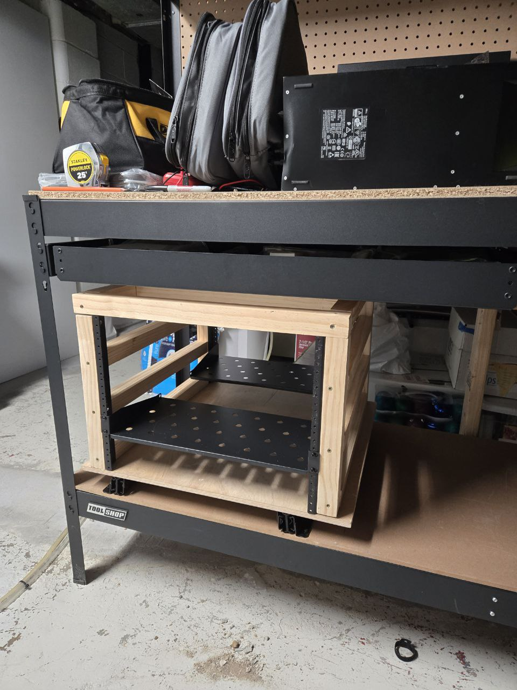

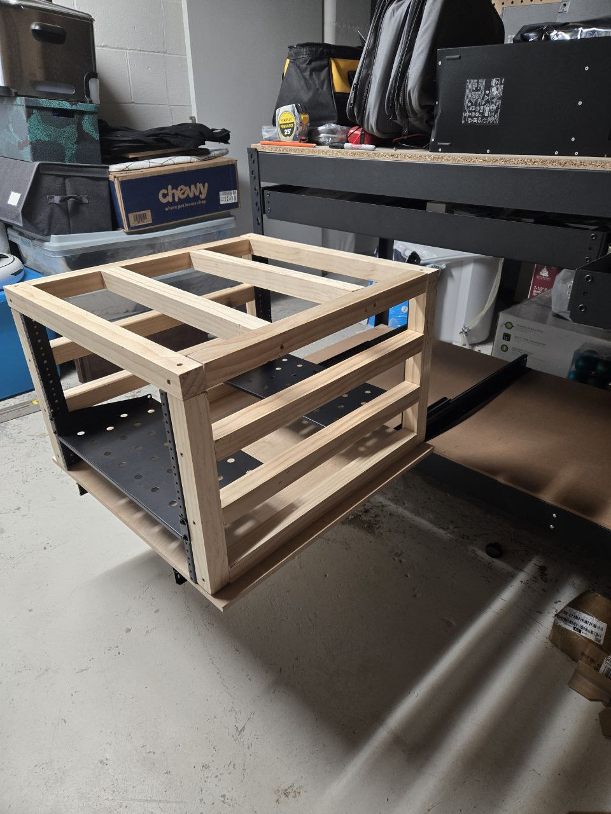

I'll be honest. There's no reason this thing should be on rails. 
The back of the rack is already completely open and accessible.
In fact it's absolutely ridiculous, the idea of a rack that contains a server
on rails that can be extended out itself being extended out on rails.
I just thought it would look super sick if it could come out and I still think
it does :)

I do think there is some potential to get some more "use" out of this design. 
I am thinking I can add some hooks or other "mounting" hardware to the sides for
hanging gear that doesn't have a home.

Also, if I outgrow this rack there is more room on the shelf to build an identical
second unit right next to it. If I have a second rack next to this one then I might
honestly feel more justified in wanting to slide the unit out to interact with the
back of the servers.

## What I Hope to Do Next Year

These are mostly "ideas" and aren't well researched yet but these are all the
ideas I want to explore more throughout the next year.

### DIY NVR

Currently I'm using Amazon's "Blink" cameras and they're... Not good.

They have the following pitfalls:

* Unreliable at catching motion detection
* Rely on a proprietary hardware and software (from a crappy company)
* Have a terribly designed app
  - Loading clips takes almost a full minute
  - I get logged out randomly and stop getting motion notifications
  - Looking at a live feed of the cameras takes a full minute to load
* Use batteries for power and need replaced periodically
* Feeding recordings of my entire property directly to Amazon which feels weird in a data sensitive world

I'm hoping to use [frigate](https://frigate.video/) with some Amcrest cameras.
I am imagining doing the following:

1. Setup a frigate server on bare metal
1. Get a PoE+ switch to replace my unmanaged switch
1. Setup a VLAN to not allow the Amcrest cameras to talk to the internet
1. Install new cameras with PoE ran through my attic

### Baremetal TrueNAS Scale

While there hasn't been any real "issues" with running TrueNAS under Proxmox
I've started to feel uncomfortable with the idea and think it would be nice to
have a dedicated appliance for my NAS since it is one of the most important servers
in my stack.

I also think this would make it easier to run some of the more storage or GPU intense
services if I had a beefier server dedicated to just those tasks. This would
include things like:

* Jellyfin
* Databases 
* Proxmox Backup Server

### Proxmox Cluster

I think it would be neat to get a three node proxmox cluster going so I can form an official
Proxmox cluster and start using things like Ceph.

### Power Monitoring

This year I actually did get a Sonoff S31 smart plug and followed some instructions
from [Acorn Talks](https://acorntalks.com/blog/sonoff-sans-soldering) to flash Tasmota
onto the device as a proof of concept.

I'm hoping that I can get more of these and then start ingesting the data exposed by Tasmota to
something like InfluxDB so I can start making a Grafana dashboard showing the power usage of
my homelab.

There's no functional reason I want to do this. I just think it sounds like fun and would be cool.

### Virtualized Proxmox Backup Server Under TrueNAS

Currently my Proxmox Backup Server is itself living on a Proxmox server. Just feels brittle.

Also if I move this VM underneath of TrueNAS then the Dataset can be replicated to my 
new offsite backup at my paren'ts house which seems like a good idea.

### Automation Exploration

Professionally pretty much everything I do is "automation first" and we use very fancy tooling to
accomplish it but none of it really fits what I'm doing in my lab and to be honest I don't want
to use the same tools in my lab that I spend all day working on. Akin to "Spend 8 hours looking
at the bad screen so I can come home and spend more hours looking at the good screen".

However, I don't actually like doing things manually which is the way I've done everything so
far. Every VM, LXC, config file change, SSH key. The whole thing top to bottom is manual.

I would like to create some automation or do some light GitOps just to make sure I'm not manually
updating servers constantly, can keep my config files versioned in Git, and can automatically
dispense common things like my user profile and SSH public key.

Next year I'm hoping to come to a conclusion on what strategy serves my lab the best.

#### NixOS

I am **so interested** in the idea of NixOS. I've never actually done an installation of it but
I'm a big fan of what it's selling which is all of my server's definitions stored in Git in
a way that is re-usable and 100% reproducible.

I don't actually know much about running NixOS but I think it solves a lot of my problems such
as dsitributing common config like my SSH public key and I think updates come through a channel
system so possibly easier to automate those?

#### Cloud Init

Cloud Init is another interesting thing I've heard of but never tried. It seems really focused
on taking a public ISO and overlaying customizations at server creation time.

I don't know if this has any way of remediating drift though or if it's a one time deal.

#### Packer

Packer is interesting and I've never tried it but it feels like it only solves the config at
creation time and doesn't really help with keeping things in line with each other through the
lifecycle of the server.

## Random Linux Story

Completely unrelated to everything else in this post but when I was working on the lab I found an
HDD and didn't realize it had a Linux install on it from one of my previous lab iterations.

I installed it into a new server as a regular storage device and accidentally booted to it only to
find that an 8 year old installation of Linux had no issue booting on completely different
hardware!

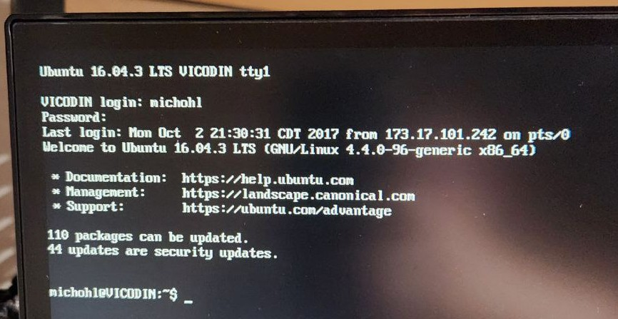

## Conclusion

This was a _very_ long winded post and was very self indulgent and not reader
optimized. So if you're looking for the TL;DR I'll try to briefly summarize some of 
the more important bits here.

### What I'm Happy With in My Current Setup

#### TrueNAS Scale

I think TrueNAS scale is a great offering and I'm a big fan of the "as an appliance" methodology
they operate on. My installation has been very hands off and makes it pretty easy to expose SMB
shares and replicate my data to another TrueNAS instance.

#### Proxmox and PBS

Proxmox continues to be a solid workhorse and hasn't failed me yet. Proxmox Backup Server was
however a new discovery and it is a super sleek way to backup Proxmox VMs and LXCs.

I did have to use this one time when one of my servers got a corrupted disk and I needed to do a
restore to a previous state.

#### Headscale

Big fan of Headscale and it has been a "no nonsense" service that doesn't cause me any headaches.

#### Offsite TrueNAS Backups

I'm very pleased with how the P2P backups ended up and it gives me more peace of mind knowing
I'm a _little_ closer to 3-2-1 backup compliant.

### What Are the Pain Points Today

#### The SFF Server Chassis

Technically I haven't really hit any walls with the SFF chassis and it does exactly what I wanted
I feel bad every time I think about the mess of cables that got jammed into that tiny box...

#### The Franken-Server Exists

Nothing is nice about looking at the franken-server and I hope to transplant it into a better
chassis.